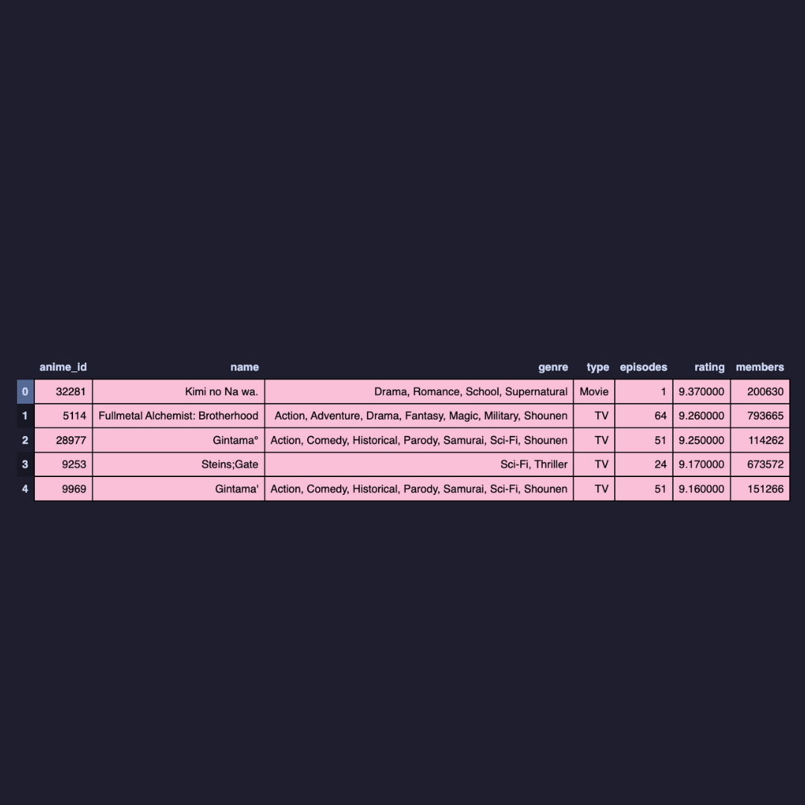
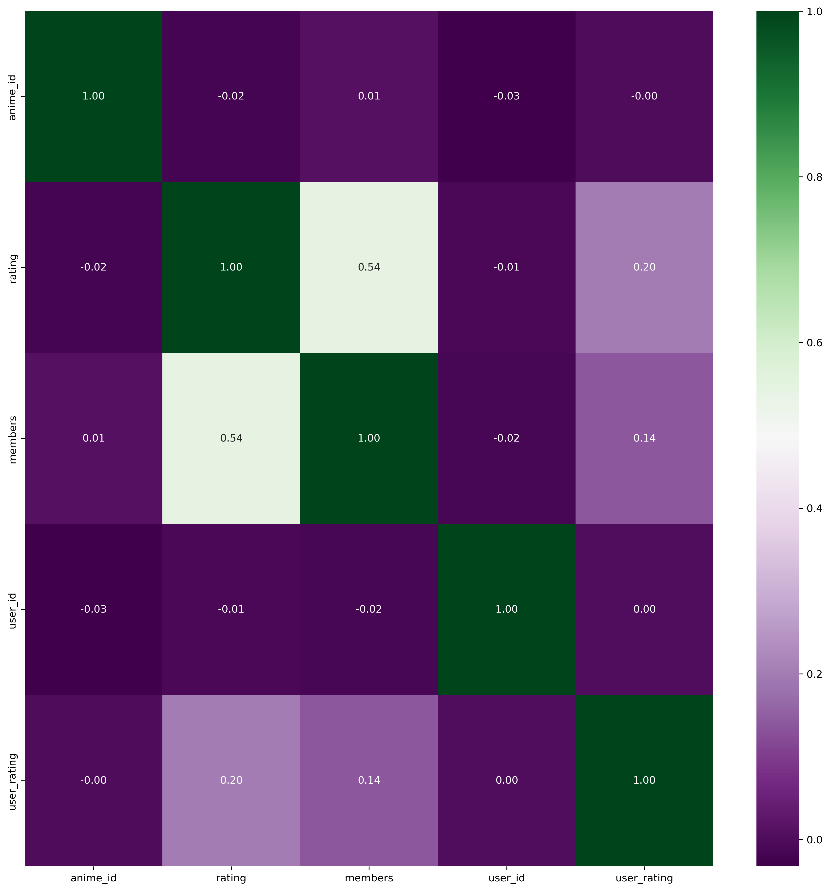
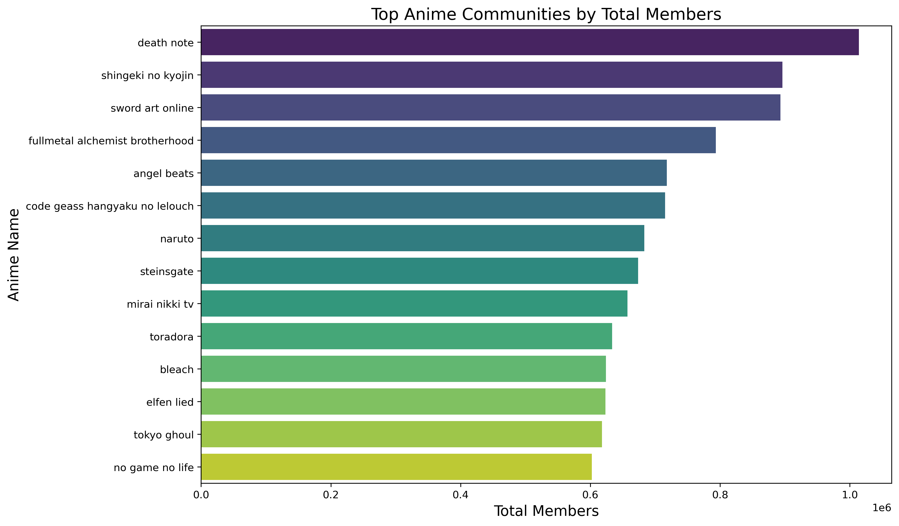
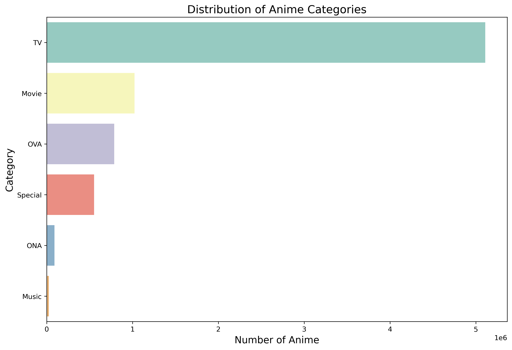
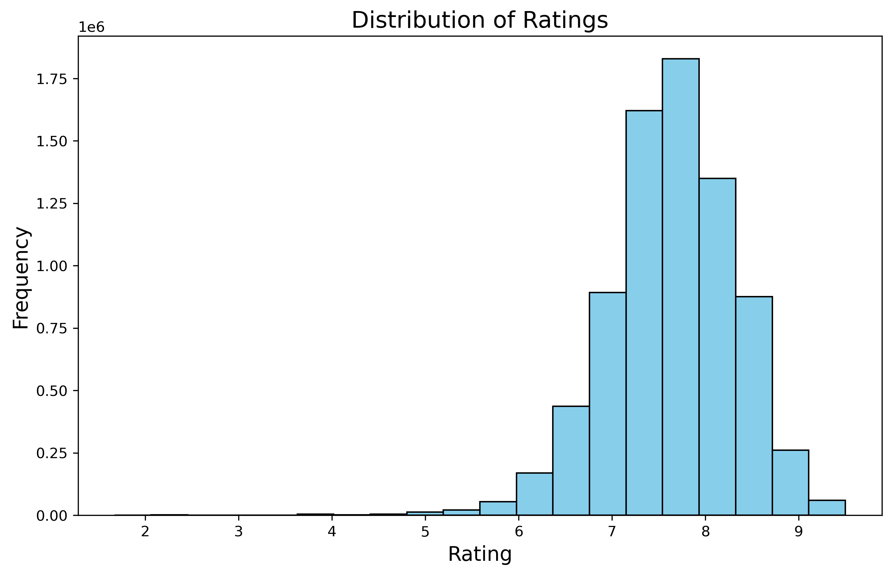
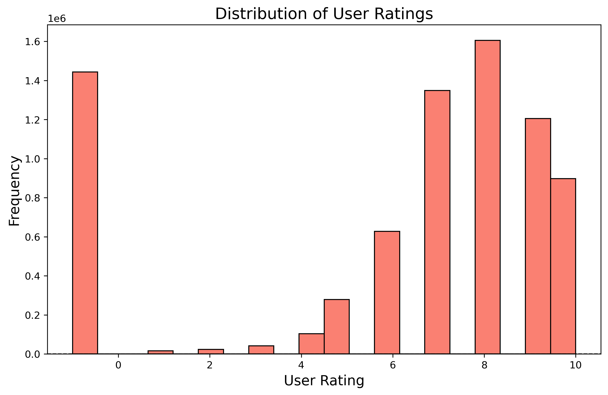
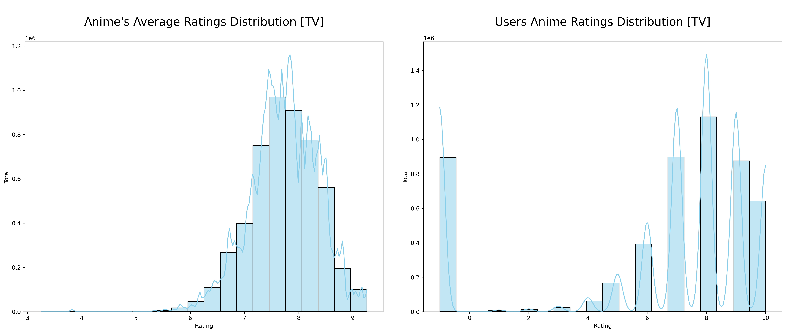
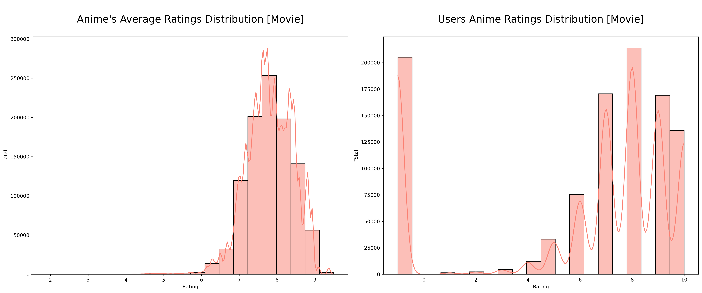
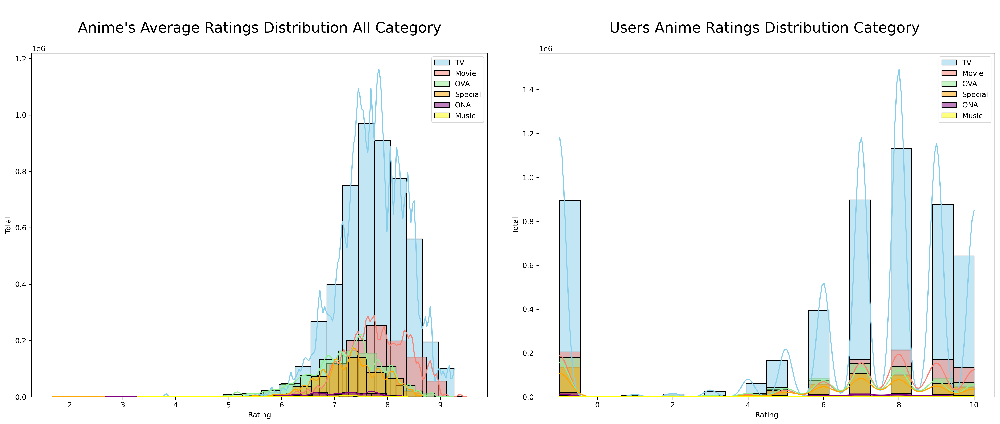
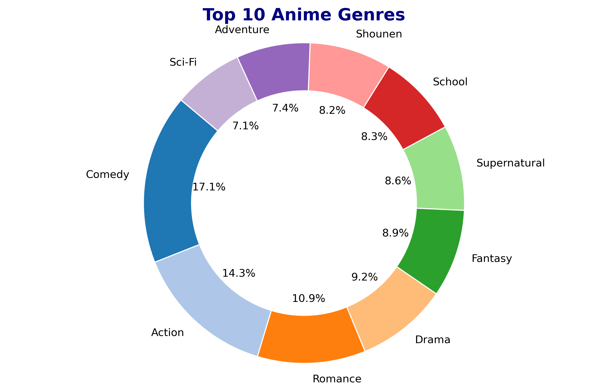

# Anime Recommendation System

## Introduction:
The proposed capstone project addresses the prevalent issue of limited anime recommendations within the anime enthusiast community. As an avid anime viewer with a personal repository of over 200 anime titles, I have identified a common challenge among enthusiasts: the need for fresh and tailored anime recommendations. Frequently, enthusiasts find themselves awaiting the release of new anime seasons or relying on mainstream suggestions, leading to a need for more diverse content exploration.

## Problem Statement:

The primary challenge faced by anime enthusiasts lies in the limited availability of new and diverse anime recommendations. The reliance on mainstream titles and the occasional suggestion of older anime with similar themes often leaves enthusiasts in search of a more efficient and person

## Objective:

This capstone project aims to develop an Anime Recommendation System that leverages an extensive anime dataset to provide tailored recommendations based on users' preferences and viewing history. The system aims to streamline the process of discovering new and relevant anime, ultimately saving users time and enhancing their anime viewing experience.

## Data Features
This data set contains information on user preference data from 73,516 users on 12,294 anime. Each user is able to add anime to their completed list and give it a rating and this data set is a compilation of those ratings.

### Anime Data Features
- **anime_id**: Unique identifier for each anime.
- **name**: The title or name of the anime.
- **genre**: The genre or genres associated with the anime.
- **type**: The type of the anime (e.g., TV, Movie, OVA).
- **episodes**: The number of episodes the anime has.
- **rating**: The average rating of the anime.
- **members**: The number of members who have added the anime to their list.

### Rating Data Features
- **user_id**: Unique identifier for each user providing a rating.
- **anime_id**: Unique identifier for the anime being rated.
- **rating**: The rating given by the user to the specific anime, with -1 indicating the user watched it but didn't assign a rating.

### What Data Set Contains

## Analysis

### Correlation Analysis

- Green squares indicate a positive correlation between variables, suggesting that as one variable increases, the other tends to increase as well. The intensity of the green color signifies the strength of this positive correlation.

- Purple squares denote a negative correlation, implying that as one variable increases, the other tends to decrease. Darker shades of purple indicate a stronger negative correlation.

- White squares typically represent no correlation, indicating little to no linear relationship between the variables.

### Distribution Analysis

#### Top Anime Genre

- Death Note is at the top for highest community members followed by Shingeki no Kyojin and Sword Art Online

### Distribution of Categories

There are 3,402 anime productions aired on TV, comprising 30.48% of the total.
2,111 anime productions are streamed as movies, accounting for 18.91% of the total.
Additionally, 3,090 anime productions are streamed as OVAs, constituting 27.69% of the total, which surpasses ONAs. ONAs include 526 anime productions, making up 4.71% of the total.

### Distribution of Overall Ratings

The majority of anime ratings fall within the range of 5.5 to 8.0, while user ratings are predominantly spread between 6.0 and 10.0.  Both distributions exhibit a left-skewed pattern, and user ratings of -1 are considered outliers and can be safely disregarded.

### Distribution of Category Ratings

**For TV anime:**
- The ratings for most TV anime are distributed between 6.0 and 8.0.
- User ratings predominantly fall within the range of 6.0 to 10.0.
- Both distributions exhibit a left-skewed pattern.
- User ratings of -1 are considered outliers and can be disregarded.

**For Movies:**

- Ratings for most anime movies are spread between 4.5 and 8.5.
- User ratings are primarily distributed between 5.0 and 10.0.
- Both distributions display a left-skewed tendency.
- User ratings of -1 are identified as outliers and can be excluded from analysis.

### Distribution of All Category Ratings

Just a showcase of All Category Ratings

### Top Anime Genre

The Top 10 Anime Genre Are

- Comedy
- Action
- Romance 
- Drama
- Fantasy
- Supernatural
- School
- Shounen
- Adventure
- Sci-Fi

## Data Cleaning for Unbiased Analysis

To ensure unbiased analysis, we've taken the following steps:

### Filtering Users by Number of Rated Anime

To mitigate biased reviews, we've filtered out users who have rated fewer than 25 anime titles.

### Cleaning Anime Names

We've implemented a function called `clean_text` to tidy up our dataset. This function removes any Japanese or special characters from anime names, ensuring consistency for analysis. It does this by:

-  Removing punctuation marks.
-  Converting text to lowercase.
-  Eliminate non-alphanumeric characters.

## Next Steps
- Learn More About **Recommendation Systems**
- Learn More About **Collaborative Filtering and Content Based Filtering and Sentiment Analysis**
- Apply Different Models such as **TF-IDF Models,KNN Models and Maybe Logistic Regression**
